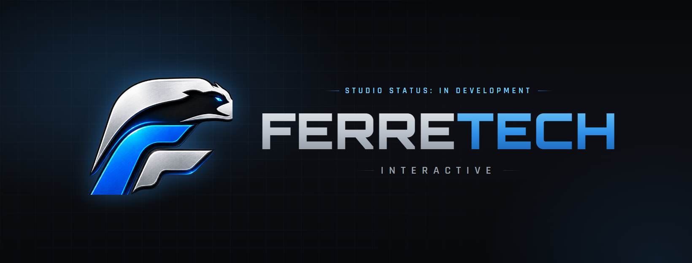
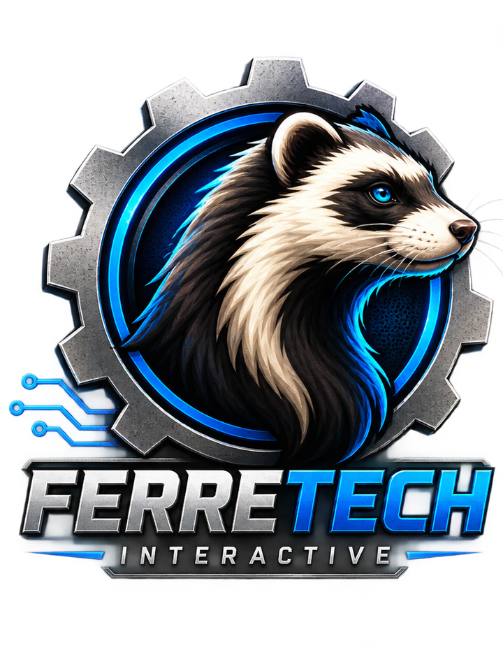
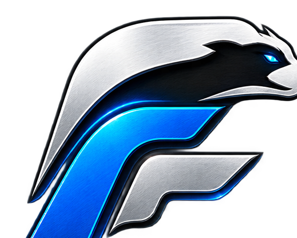

### [Website](https://www.ferretech.org) · [About](https://www.ferretech.org/about.html)

---

FerreTech Interactive partners with select open source projects in the gaming sector.
We're not building in a vacuum — we work alongside maintainers to harden, extend, and
modernize the tools game communities already depend on, from the servers running behind
the scenes to the tools players and creators use in-game.

## What we focus on

- 🤝 **Open Source Partnerships** — contributing code, infrastructure, and momentum to
  promising projects rather than starting from scratch.
- 🎮 **Server & In-Game Tooling** — built for the realities of live games: uptime,
  performance under load, and interfaces people actually want to use.
- 🌱 **Community-Driven** — the projects we support exist because communities built
  them. We aim to give back more than we take.

## Meet the mascot

<table>
<tr>
<td width="180" align="center" valign="middle">

</td>
<td valign="middle">

Quick, curious, and impossible to keep out of the codebase — the Ferret is FerreTech's
mascot and unofficial spirit animal. Equal parts sharp and playful, it's a reminder that
serious engineering doesn't have to take itself too seriously.

</td>
</tr>
</table>

---

 
&copy; FerreTech Interactive LLC

